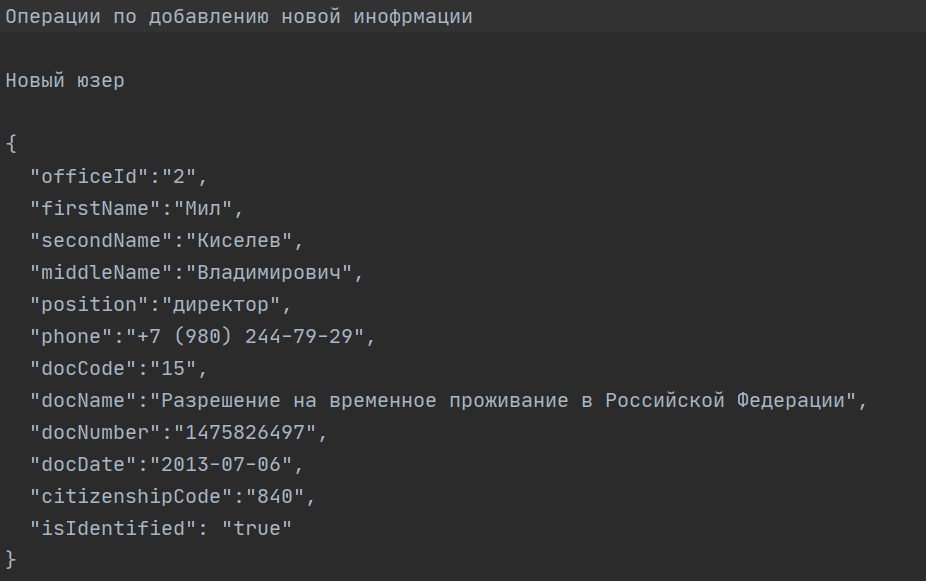
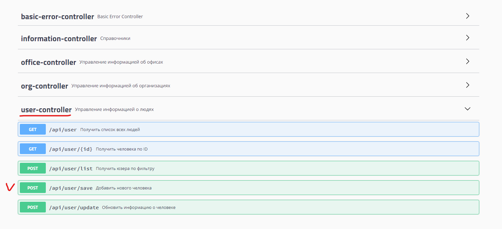
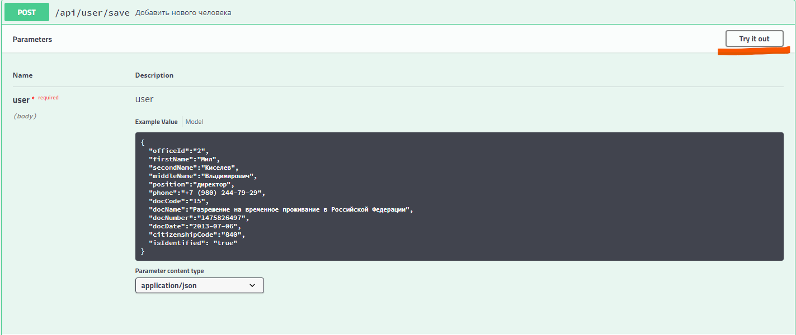
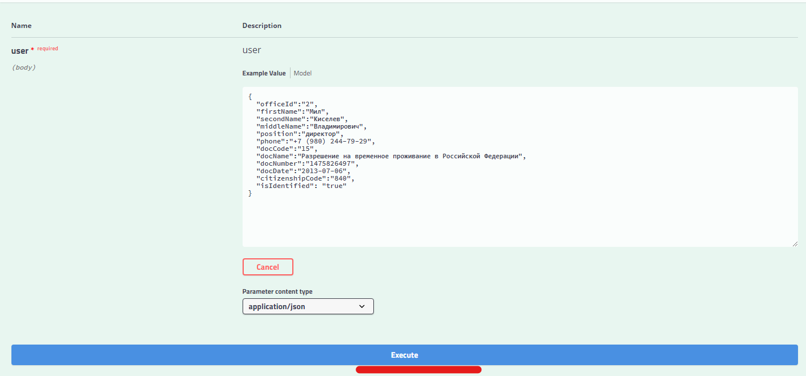
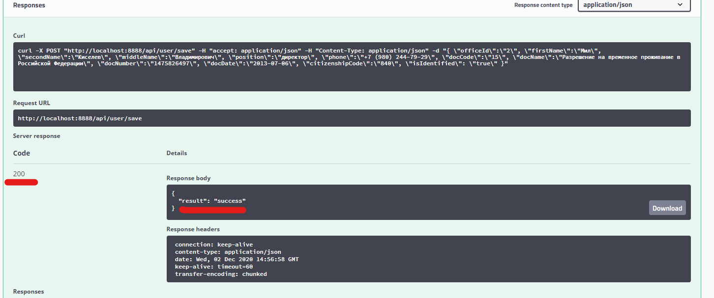

# Bell_Integrator_SpringBootAPI
Task for Bell Integrator

Программа для вывода/ввода информации в базу SQL.
На входе и на выходе программы - JSON объект

Для более удобного просмотра функционала, присутствует Swagger UI. Страница Swagger: http://localhost:8888/swagger-ui.html

Присутствует файл "Тестовые данные", в которых Json запросы, на которых тестирована программа. 

**На данный момент реализовано:**

-Вывод всей информации

-Вывод информации по ID

-Вывод информации по фильтру

-Добавление информации

-Редактирование информации

**Используемое ПО:**

-Apache Maven 4.0.0

-Java version: 11.0.6, vendor: Oracle Corporation

-spring-boot-starter 2.3.4.RELEASE

-База данных H2

**Установка и запуск:**
1. Скачать архив репозитория. 
2. Разархивировать в папку.
3. Открыть проект в IDE
4. Через pom.xml проверить, что добавились все зависимости. 
5. Запустить программу, запустив Application.class
6. Доступ к управлению программой, по дефолту, будет по адресу: http://localhost:8888/

**Для удобства использования, будем передавать запросы через Swagger, по адресу http://localhost:8888/swagger-ui.html**

Основное окно:

В корневой папке репозитория находится файл с тестовыми данными для проверки операций Добавления, Изменения и Поиска информации. 

**Пример использования программы для добавления нового пользователя**
1. Открываем файл с тестовыми данными. И копируем информацию в Json формате

2. По адресу http://localhost:8888/swagger-ui.html находим интересующий нас раздел и контроллер. В нашем случае раздел - "user-controller
Управление информацией о людях" и операция добавления нового пользователя "/api/user/save
Добавить нового человека"

3. Нажимаем кнопку "Try it out" для использования операции.

4. Вставляем нашу информацию, скопированную из файла с тестовыми данными и нажимаем кнопку "Execute"

5. Проверяем, что наша сервер обработал информацию и добавил нового пользователя.(Должны получить ответ с кодом 200 и информацией об успешном добавлении)

