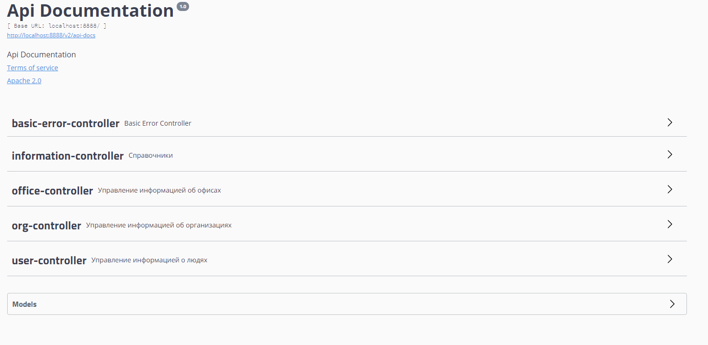

# Bell_Integrator_SpringBootAPI
Task for Bell Integrator

Программа для вывода/ввода информации в базу SQL.
На входе и на выходе программы - JSON объект

Для более удобного просмотра функционала, присутствует Swagger UI. Страница Swagger: http://localhost:8888/swagger-ui.html

Пристутствует файл "Тестовые данные", в которых Json запросы, на которых тестирована программа. 

На данный момент реализовано:

-Вывод всей информации

-Вывод информации по ID

-Вывод информации по фильтру

-Добавление информации

-Редактирование информации

**Используемое ПО:**

-Apache Maven 4.0.0

-Java version: 11.0.6, vendor: Oracle Corporation

-spring-boot-starter 2.3.4.RELEASE

-База данных H2

**Установка и запуск:**
1. Скачать архив репозитория. 
2. Разархивировать в папку.
3. Открыть проект в IDE
4. Через pom.xml добавить все зависимости. 
5. Запусить программу, запустив Application.class
6. Дступ к управлению программой, по дефолту, будет по адресу: http://localhost:8888/

**Для удобства использования, будем передавать запросы через Swagger, по адресу http://localhost:8888/swagger-ui.html**

Основное окно:

В корневой папке репозиторя находится файл с тестовыми данными для проверки операций Добваления, Изменения и Поиска информации. 

